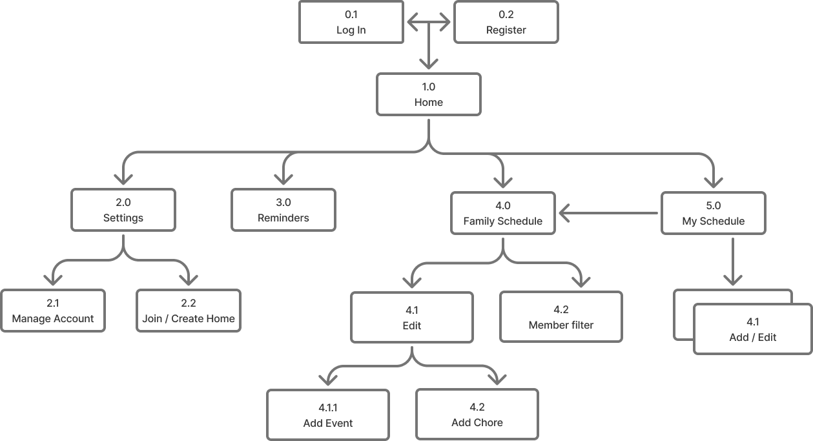
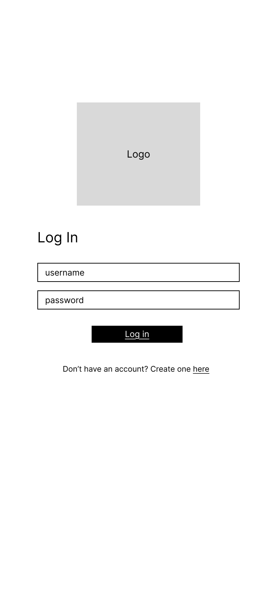
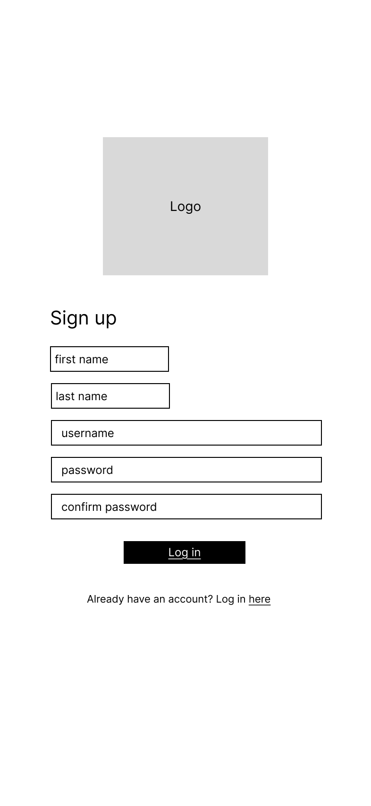
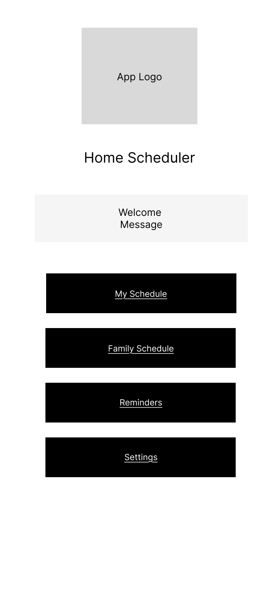
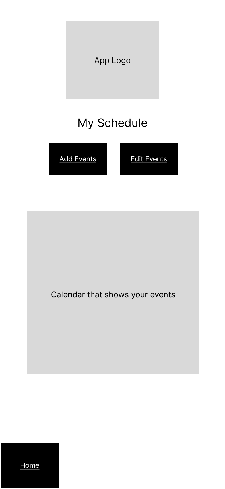
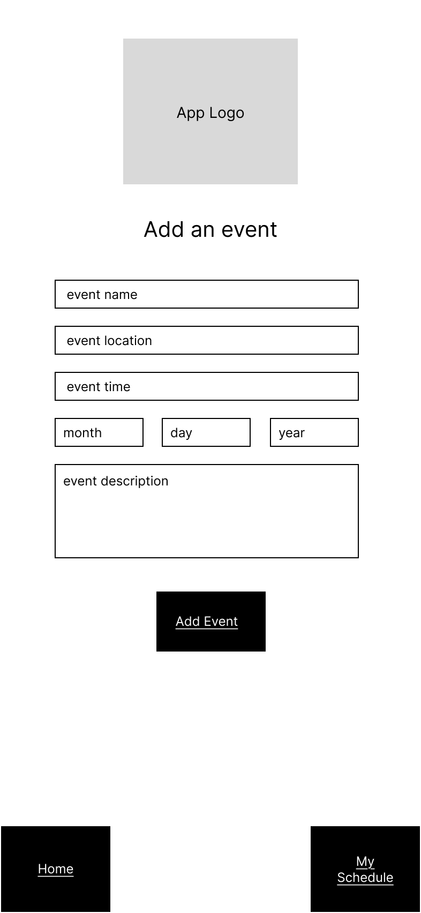
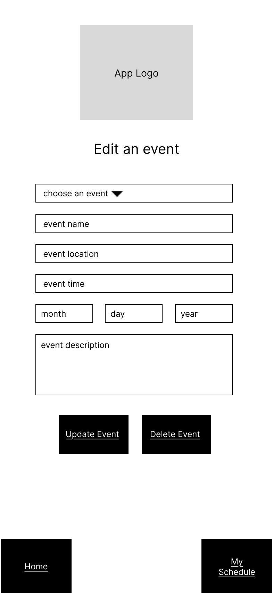

# User Experience Design

This repository contains instructions and files for two assignments that together comprise the user experience design phase of a web app.

This is the overall strcture of the web app and how each part of the app connects to each other

## Login/ Register
The user inputs their username and password to login into their account if the user does not have an account they can click a link to register for one

If the user does not have an account they can register for one that will automaatically log them in

## Home
Onced logged in the user can either go to their 
- **settings** 
- **reminders**
- **family schedule** 
- **personal schedule**

## My Schedule
On the My schedule page you have two options, to either add an event or to edit an existing event

### Add Event

### Edit Event

## Family Schedule

### Add Family Event

### Edit Faimly Event

## Reminder 
### Add Reminder
### Edit Reminder
## Settings
### Manage Account
### Join/Create Home
### Edit Password

- [app map & wireframe instructions](instructions-0a-app-map-wireframes.md).
- [prototype instructions](instructions-0b-prototyping.md)
