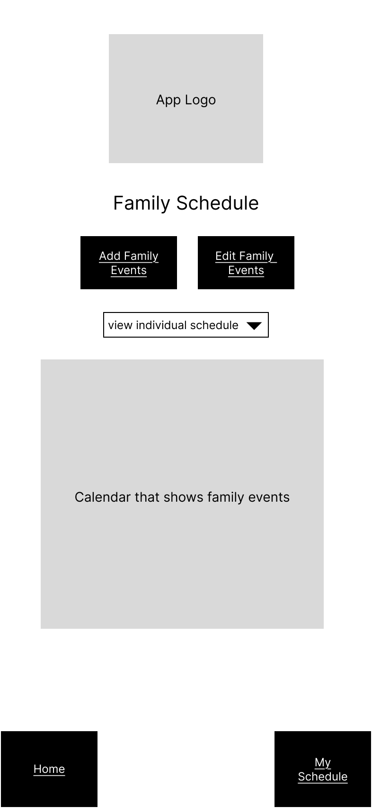
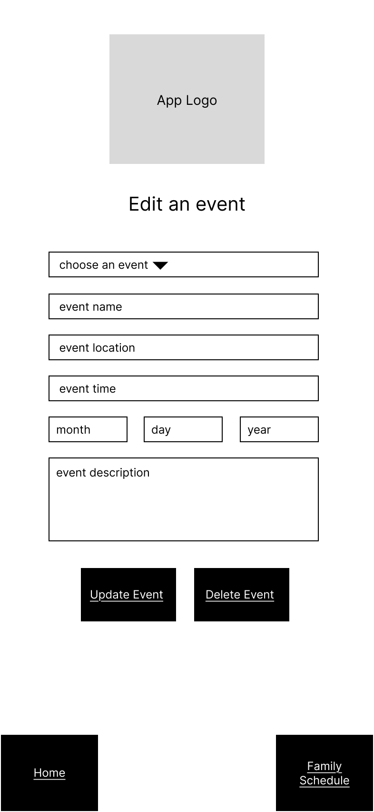
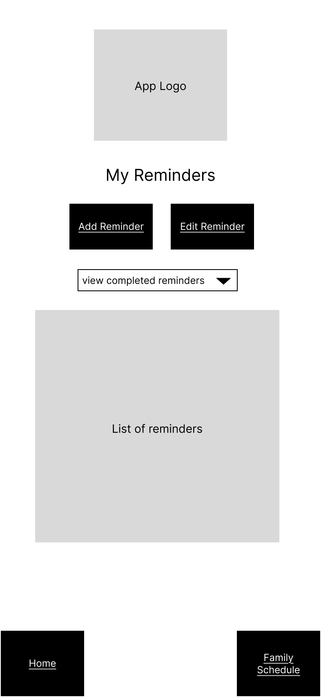
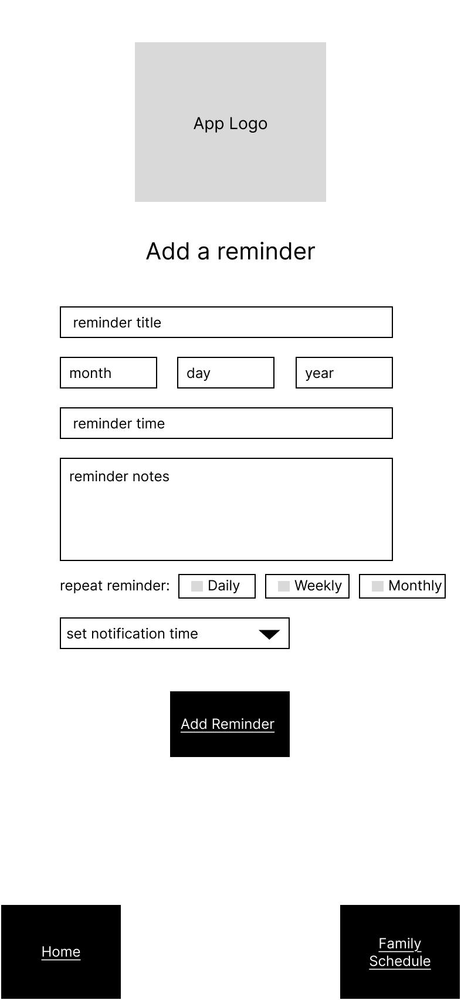
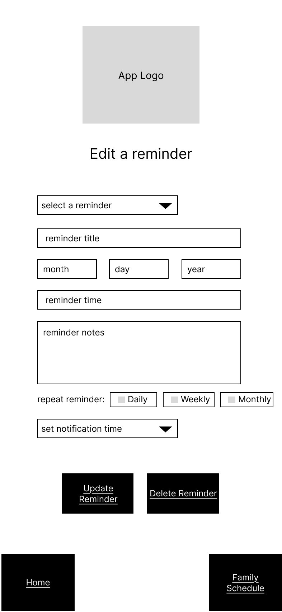
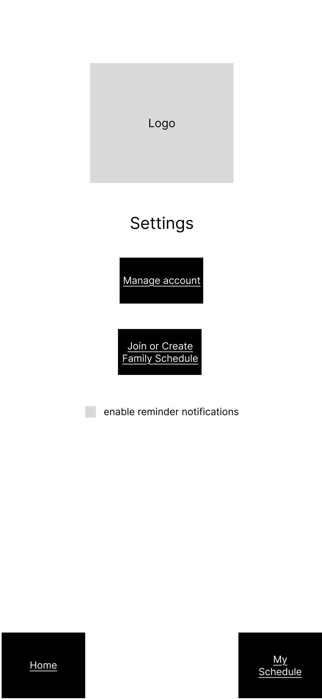
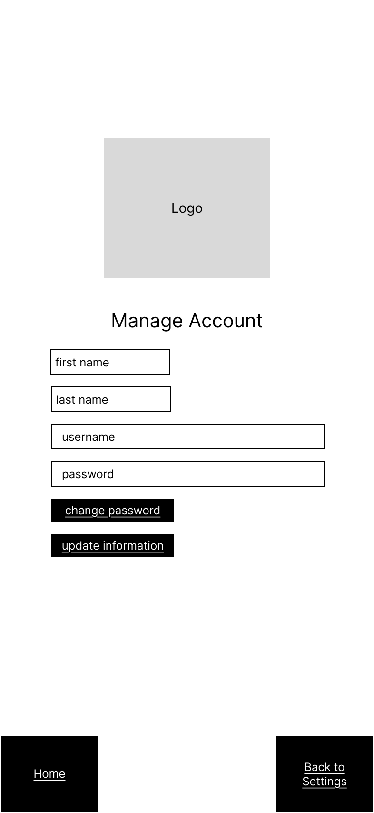
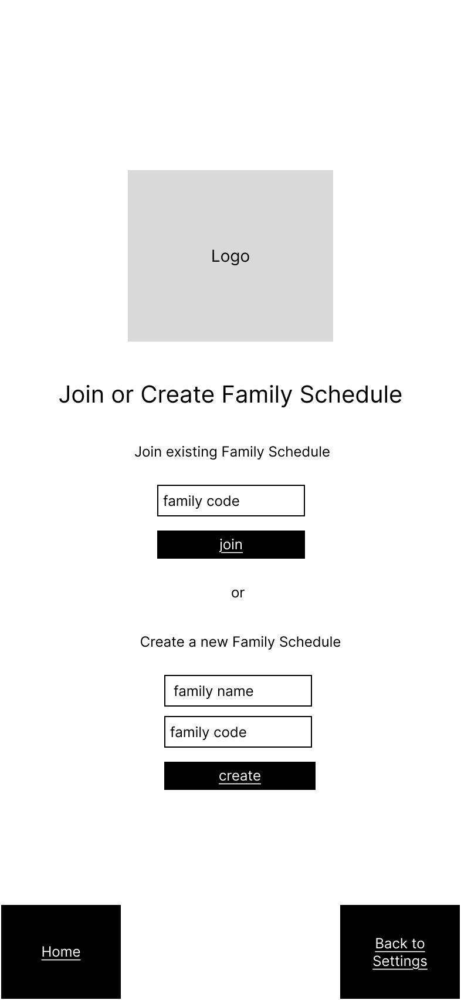
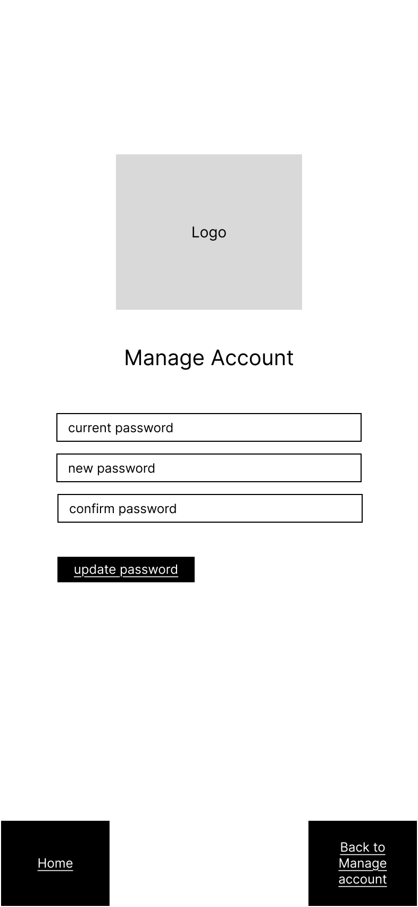

# User Experience Design

This repository contains instructions and files for two assignments that together comprise the user experience design phase of a web app.

This is the overall strcture of the web app and how each part of the app connects to each other

## Prototype 

### [Link to prototype](https://www.figma.com/proto/R9drmfZLYn61j27wUldn4J/Home-Scheduler?node-id=1-236&p=f&t=C8VFrnYV91aQy0LR-1&scaling=scale-down&content-scaling=fixed&page-id=0%3A1&starting-point-node-id=1%3A545)

## Login
The user inputs their username and password to login into their account if the user does not have an account they can click a link to register for one

## Register
If the user does not have an account they can register for one that will automaatically log them in

## Home

Onced logged in the user can either go to their 
- **settings** 
- **reminders**
- **family schedule** 
- **personal schedule**

## My Schedule

On the My schedule page you have two options, to either add an event or to edit an existing event

### Add Event

Allows user to create a new event and set the time and date of the event and give it a descrption 

### Edit Event
Allow user to edit an exsiting event or delete an exsiting event

## Family Schedule
The page displays a caldner for existing events and gives the user the options of creating a new event or editing an existing event

### Add Family Event
Allows the user to set an event name, time and description

### Edit Faimly Event
Allows the user to edit an event name, time and description or to delete and event

## Reminder 
Displays a list of reminders and the user can also view completed reminders. Allow usser to Add or delete a reminder.

### Add Reminder
Allows user to create a Reminder and set a date and how many times to repeat the reminder

### Edit Reminder
Allows the user to edit exsiting Reminders

## Settings
On this page the user can allow notifications and create a family schedule or manage their accounts

### Manage Account
The user can change their username and password

### Join/Create Home
The user can join a family with a family code or they can create their own family

### Edit Password
on this page the user can set their new password

- [app map & wireframe instructions](instructions-0a-app-map-wireframes.md).
- [prototype instructions](instructions-0b-prototyping.md)
